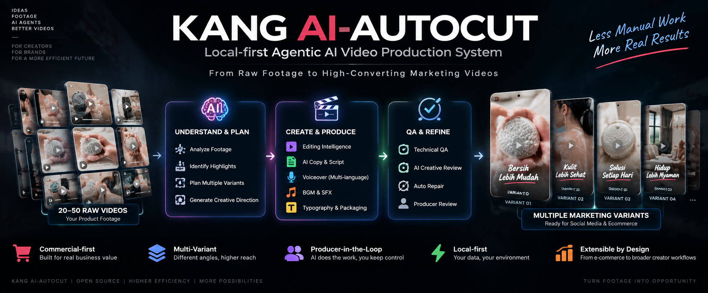
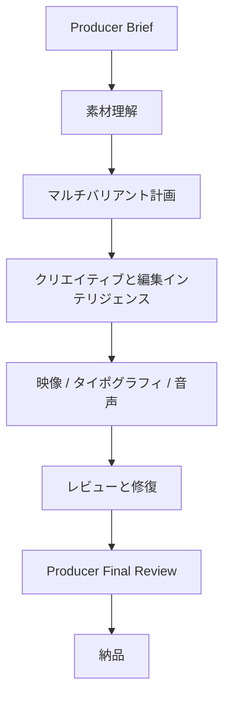

# Kang AI-AutoCut

**Local-first Agentic AI Video Production System**

**ローカルファーストの Agentic AI 動画制作システム**

**Languages:** [English](README.md) | [简体中文](README.zh-CN.md) | 日本語 | [한국어](README.ko.md) | [Bahasa Indonesia](README.id.md) | [Deutsch](README.de.md) | [Español](README.es.md)

[](LICENSE)
[](README.md#installation)
[](README.md#installation)
[](docs/decisions/ADR-0007-local-first.md)
[](README.md#use-with-an-ai-agent)
[](README.md#installation)
[](README.md#installation)
[](README.md#frozen-baseline)

*バッジは静的であり、凍結ベースラインの状態を示すものである。このリポジトリは CI
ワークフローを実行しておらず、バッジの数値はライブのステータスではない。*

Kang AI-AutoCut は、FFmpeg のつなぎ合わせスクリプトではなく、Agent 指向の動画制作
システムである。使用許諾を得た素材映像と明示された制作ゴールを受け取り、**8 つの制作
ステージ** — 素材理解、編集インテリジェンス、ナラティブ設計、タイムライン構築、
ピクチャ仕上げ、タイポグラフィ、オーディオ、マスタリング、レビューと修復 — を通じて
作業を推進する。**人間の承認は明示的なゲート**として扱われる。

本システムはあなた自身のマシン上で動作する。制作制御パスとメディア処理は
ローカルファーストであり、外部 AI プロバイダーが受け取るのは、承認された
インテリジェンス処理または生成タスクに明示的に必要な入力のみである。制作上のあらゆる
意思決定は記録され、測定できない成功を報告することはない。

> **商用ファーストであり、設計として拡張可能。** 商用広告が最初の制作検証済み
> ワークフローである。アーキテクチャは、より広範なクリエイター向け・メディア向け
> ワークフローへ拡張できるよう構築されている。

```
Raw Footage
    ↓
Understand  →  Plan  →  Edit
    ↓
Picture  ·  Typography  ·  Audio
    ↓
Assemble & Master
    ↓
Review  →  Repair  →  Human Approval
    ↓
Final Video
```

---

## できること

**Kang AI-AutoCut に素材フォルダと Producer Brief を渡してください。**

システムは素材を理解し、商業的に異なるバリアントを計画し、編集を組み立て、ローカライズ
されたコピー・タイポグラフィ・音声を作成し、結果をレビューして、制作可能なマーケティング
動画へと作業を進めます。

完全自動の動画工場ではありません。2 つの判断は意図的に人に残します。

- **Creative Copy Approval**
- **Producer Final Review**

---

## 素材からマーケティングバリアントへ

```
20–50 の素材クリップ
      ↓
素材理解
      ↓
編集インテリジェンス
      ↓
商業ナラティブ
      ↓
映像  +  タイポグラフィ  +  音声
      ↓
QA  +  修復
      ↓
バリアント 01  ·  バリアント 02  ·  バリアント 03  ·  …
```

1 つのソースプールから**商業的に異なるバリアント**を生み出せます。各バリアントは前の
タイムラインを継承せず、プール全体を独立に再検討します。

> **商業的に意味のある差異は、人工的な最大多様性より優先される。**

1 つのタイムラインの音楽を差し替えたものではありません。

---

## 制作例

*制作ショーケースは準備中です。*

本リポジトリはまだ制作マスターを公開しておらず、この節を埋めるための創作も行いません。

```
assets/showcase/
  kang-ai-autocut-hero.png   ヒーローバナー
  variant-preview.gif        バリアントプレビュー（将来）
  contact-sheet.png          コンタクトシート  （将来）
```

---

## 仕組み



*製品レベルの流れです。詳細な工程は下の文章にあります。*

---


## Kang AI-AutoCut を選ぶ理由

多くの AI 動画ツールは、チャットウィンドウの中で **1 本の動画を 1 回だけ** 生成する。
再実行すれば別の動画が出力され、プロセスのどこも検査できない。

Kang AI-AutoCut は、動画制作を **エンジニアリングパイプライン** として扱う:

| 一般的な AI 動画出力 | Kang AI-AutoCut |
|---|---|
| 一度きりの結果で、再現が難しい | 何度でも実行できる再利用可能なワークフロー |
| 意思決定はチャットログの中にある | すべての意思決定が記録された成果物として残る |
| 失敗は最初からのやり直しを意味する | ジョブは停止したステージから再開する |
| 「できたように見える」ことが唯一の確認手段 | 出力は測定される: フレーム数、黒フレーム、フリーズ、ラウドネス、トゥルーピーク、マスターのハッシュ |
| モデルがステップを黙って飛ばすことがある | ステージは**実行したケイパビリティを明示しなければ通過できない** |
| 人間の判断が見えない | 人間の入力は名前を持つゲートで行われ、記録される |
| あなたの素材はプロバイダーにアップロードされる | 処理はローカルファーストであり、プロバイダーはタスクが必要とする入力のみを受け取る |

---

## 何を作れるか

**現在、制作検証済み:**

- **商用広告および EC 向け商品動画** — 納品マスターの検証まで含め、エンドツーエンドで
  実施された最初のワークフロー。
- **SNS 向けショート尺の商品コンテンツ** — 縦型・短尺の商用編集で、同じ 8 つの
  ステージを使用する。

**アーキテクチャが拡張対象として設計している方向性** — *まだ制作検証されていない*:

- クリエイターおよびセルフメディアの動画
- 商品デモンストレーションおよび解説コンテンツ
- ブランドおよびキャンペーンコンテンツ
- その他の構造化された動画制作ワークフロー

本システムは現時点で商用ファーストである。ここでは、あらゆる動画カテゴリがすでに
サポートされているとは主張しておらず、コンテンツモードのフレームワークもまだ存在
しない。

---

## 仕組み

### あなたが行うこと

1. **素材を追加する** — ソース動画のディレクトリをシステムに指定する。
2. **ゴールを明示する** — 商品、プラットフォーム、言語、目標尺、そして動画が主張して
   よいこと・してはならないこと。
3. **Agent にパイプラインを実行させる** — Agent はステージを進め、あなたの判断が
   必要な時点で停止する。
4. **ゲートに答える** — コピーを承認する、不足している成果物を提供する、または制作上の
   判断を下す。
5. **最終動画を承認する** — 名前を持つ人間がマスターをリリースする。このリリースは
   レビューとは別の意思決定であり、承認するマスターを正確に特定する。

### システムが行うこと

制作制御パス（Fast Path）は **8 つの意味的ステージ** を実行する:

| # | ステージ | 何が起きるか |
|---|---|---|
| 1 | **PREPARE** | ファイル単位の不変ダイジェストを伴うソースインベントリ |
| 2 | **UNDERSTAND SHOTS** | メディアが解析され、測定されたタイムスタンプを CFR 解析グリッドにマッピングして実際の映像セグメントを特定する |
| 3 | **PLAN THE EDIT** | タイムラインの範囲が観測可能なアクションに対して検証される — アクションの開始や結果を外したカットは拒否される |
| 4 | **FINISH THE PICTURE** | ソース範囲がタイムベース不変条件を通して抽出・測定され、ショットごとに KEEP / REVIEW / CORRECT の判断が下される |
| 5 | **PLAN THE WORDS** | 有料の音声作業の**前に**ナレーションのカバレッジが確認される。その後スクリーンコピーがレンダリングされる |
| 6 | **BUILD THE AUDIO** | FIT / SYNC / RHYTHM が個別に判定され、その後ミックスが構築され**測定**される |
| 7 | **ASSEMBLE & MASTER** | 納品マスターが生成され、その後ファイル自体に対して検証される |
| 8 | **REVIEW & REPAIR** | すべてのレビュー次元が判定され、判定が導出され、人間のリリースゲートを経る |

### 2 つのビューの対応

```
USER VIEW                          SYSTEM VIEW (8 stages)
─────────────────────────────      ──────────────────────────────────────
1  add raw footage            →    PREPARE
2  state the goal             →    (job manifest + brief)
3  understand the material    →    UNDERSTAND SHOTS
4  build the editing strategy →    PLAN THE EDIT
5  construct the timeline     →    PLAN THE EDIT
6  finish the picture         →    FINISH THE PICTURE
7  titles / copy / typography →    PLAN THE WORDS
8  voice / music / audio      →    BUILD THE AUDIO
9  assemble and master        →    ASSEMBLE & MASTER
10 review and repair          →    REVIEW & REPAIR
11 human approval             →    REVIEW & REPAIR (human release gate)
12 final video                →    delivered master
```

### ステージは意図的に停止する

必須の入力が欠けている場合、実行は **停止し、誰が対応すべきかを明示する**:

```
   Stage ──▶ [ PRODUCER GATE ] ──▶ Stage
                 │
                 ├─ which artifact is missing
                 ├─ which producer is responsible (AUTO / CODEX / HUMAN / ADAPTER)
                 ├─ the input and output contract
                 ├─ the procedure to follow
                 ├─ the evidence required
                 └─ what must become true to resume
```

**Producer Gate（プロデューサーゲート：宣言された生産者が成果物を提供または承認する
まで、システムが意図的に停止する仕組み）は失敗ではない。** これは、システムが制作上の
判断を勝手に捏造すること、あるいは行っていない作業を完了したと主張することを拒否して
いるのである。自動化されているステージもあれば、Agent、プロバイダーアダプター、または
人間を正当に必要とするステージもある。"generate or prepare"、"Agent supplies"、
"job-authored when required" という表現は、この README 全体で意図的に用いられている。

---

## 現在のケイパビリティ

### 現在利用可能で検証済み

| ケイパビリティ | 備考 |
|---|---|
| ソースの取り込みと不変インベントリ | ファイル単位の SHA-256 を、使用前に再検証する |
| VFR 安全なメディア理解 | 測定されたタイムスタンプを CFR 解析グリッドにマッピングする |
| 映像セグメンテーション | エンジンが実際にデコードするグリッド上で実行される |
| タイムライン範囲の検証 | 観測可能なアクションを外したカットを拒否する |
| ソース範囲の抽出 | すべての範囲を測定されたタイムスタンプから解決する |
| ピクチャ実行 | 実際の動画成果物を生成し、その後に再測定する |
| ナレーションカバレッジ | 有料の音声生成より前に実行される |
| タイポグラフィのレンダリング | ジョブ自身のレイアウトとフォントから実際の出力を生成する |
| オーディオのミックスとマスタリング | 実際のミックスと、測定されたラウドネス・トゥルーピーク・クリッピング |
| パッケージングと最終マスター | `final/master.mp4` と、測定された技術 QA |
| レビューコントラクトとリリース判定 | 各次元を一度だけ判定し、判定は主張ではなく導出される |
| 対象を絞った修復計画 | 影響を受けたレイヤーにスコープを固定する |
| 人間のリリースゲート | 承認するマスターを特定する、独立した意思決定 |
| 介入台帳 | ゲートが実行を停止するたびに自動的に記録される |
| 再開と無効化 | 最初の未完了ステージから再開し、ステージを無効化すると下流がすべて再オープンされる |
| マスター整合性検証 | ダイジェストを再計算し、削除または改変されたマスターは検証に失敗する |

### ゲート付き / ジョブ側で作成

これらは動作するが、消費する成果物はジョブごとに提供される — Agent、アダプター、または
人間によって:

| ケイパビリティ | まだ提供が必要なもの |
|---|---|
| 読み取り専用のピクチャ測定 | このリポジトリには測定ツールが同梱されていない |
| 商品真正性の保護 | 同上。その許容差チェックはまだ実データで実行されていない |
| KEEP / REVIEW / CORRECT の判断 | 判断は実行されるが、`CORRECT` に対して処理を行うものはここにはない |
| オーディオプログラムの検証（FIT / SYNC / RHYTHM） | これが消費する音声配置 |
| 音声 / 音楽の生成 | プロバイダーアダプターによって提供される。**組み込みではない** |

### 計画中 / 拡張可能

未実装であり、主張もしていない: 自動商用レビュアー、汎用バックエンドコンパイラ、成果物
レジストリ、ジョブキュー、無人ワンコマンドランナー、およびより広範なコンテンツモードの
ワークフロー。

---

## AI Agent と組み合わせて使う

Kang AI-AutoCut は **Agent とともに操作される** よう設計されている — あなたの
ファイルシステムとシェル上で操作できるモデルであり、チャット専用モデルではない。

**特定の Agent 製品に縛られない。** 互換性はケイパビリティベースで判断する:

| Agent に必要な能力 | 理由 |
|---|---|
| リポジトリのファイルを読める | `README.md`、`PROJECT_IDENTITY.md`、`AGENTS.md` に従うため |
| シェルコマンドを実行できる | FFmpeg、FFprobe、Python、テストスイート |
| ローカルファイルを読み書きできる | ジョブ状態、成果物、メディアのステージング |
| Python と FFmpeg のワークフローを実行できる | すべてのステージがローカルかつ決定論的であるため |
| 構造化された JSON 成果物を理解できる | ジョブ、レビュー、エビデンス、マニフェスト |
| **Producer Gate で停止できる** | 推測するのではなく、あなたに確認するため |
| リポジトリの境界を守れる | Git 外のメディア、シークレットなし、マシン依存パスなし |

能力の高い Agent の例としては Codex、DeepSeek Harness、Claude Code、その他の
コーディング系・コンピュータ操作系 Agent がある。**これらは例であり、要件でも推奨
統合でもない。**

**チャット専用モデルはこのシステムを操作できない。** ファイルシステムとシェルへの
アクセスがなければパイプラインを実行できず、話題にすることしかできない。

### 内部ガバナンスと公開互換性

これらは別物であり、どちらも真である:

- **内部的には**、検証済みの制作ワークフローは **Codex をトップレベルの Supervisor
  として** 使用する。制作上の権限はそこにあり、システムは、決定論的コンポーネントが
  動画が何を語るべきかを決めることがないように構築されている。
- **公開面では**、リポジトリはアーキテクチャが許す限り **Agent 非依存** であり続ける
  ことを目指している。制御パスの中で特定ベンダーの Agent にハードロックされている
  部分はない。

---

## Agent クイックスタート

能力の高いコーディング Agent に、リポジトリの URL と次のようなプロンプトを渡す:

```text
このコンピュータに、リポジトリの手順に従って Kang AI-AutoCut をインストールして
ください。

リポジトリ: https://github.com/KanG-ciyuan/Kang-AI-AutoCut

何かを変更する前に:
1. README.md、PROJECT_IDENTITY.md、AGENTS.md を読むこと。
2. 環境を確認すること: Python、FFmpeg/FFprobe、およびコードが実際にインポートして
   いる Python パッケージ。
3. 不足しているものを報告すること。私が承認していないものをインストールしないこと。

次に:
4. ローカルワークスペースとメディアルートを、論理ロールと環境変数のみを使って設定
   すること。メディアは Git の外に置くこと。
5. API キー、トークン、認証情報を、追跡対象のファイル、ログ、コミットのいずれにも
   書き込まないこと。
6. 私の最初の動画ジョブを作成する前に、リポジトリのセルフテストを実行すること。

ジョブを開始するとき:
7. 制作制御パスを実行し、すべての Producer Gate で停止すること。
8. ゲートが人間の判断または制作上の承認を必要とするときは、私に確認すること。
9. 私に代わってコピー、アートディレクション、主張を勝手に作らないこと。
```

**それでも Agent が手作業で行う必要があること。** インストールは現在、完全には自動化
されていない。インストーラーもパッケージングマニフェストも、宣言された依存ロック
ファイルも存在しない。Agent は環境を調査し、あなたが承認した前提条件をインストールし、
ローカルパスを設定しなければならない。以下の README は検証済みの内容を正確に列挙して
おり、リポジトリには `pyproject.toml` も `requirements.txt` も存在しない — これは既知の
ドキュメント上のギャップであり、隠された手順ではない。

---

## インストール

### 検証済みの前提条件

| 要件 | ステータス |
|---|---|
| **Python 3** | 3.11.15 で検証済み。リポジトリは最低バージョンを宣言していない — これはギャップとして扱うこと。 |
| **FFmpeg と FFprobe** | 必須。ffmpeg/ffprobe 9.0.1 で検証済み。 |
| **`numpy`** | メディア理解モジュールが必要とする |
| **`Pillow`** | タイポグラフィ実行アダプターが必要とする |
| **macOS** | macOS arm64 で検証済み。Windows と Linux は**未検証**。 |

`pyproject.toml`、`setup.py`、`requirements.txt` のいずれも存在しないため、ここで
バージョン固定は主張しない。存在しないロックファイルを信用するのではなく、実際の
インポートを読むこと。

### セットアップ

```sh
git clone https://github.com/KanG-ciyuan/Kang-AI-AutoCut.git
cd AI-AutoCut

# Local configuration: resolves environment variables, never machine paths
cp config/examples/autocut.env.example .env.local
# edit .env.local: set AUTOCUT_MEDIA_ROOT and AUTOCUT_WORKSPACE
```

### インストールの検証

```sh
# Full offline regression — no network, no media required
PYTHONDONTWRITEBYTECODE=1 python3 -m unittest discover -s tests

# End-to-end execution proof — builds its own media, produces a real master
python3 scripts/run_pre_exam_proof.py --job-root /tmp/pre-exam-proof
```

この証明（proof）は意図的に 2 段階である。人間のリリースゲートで停止し、**検証済み**の
マスターを名指しするリリースを書き出したうえで、完了まで再開する。マスターが削除または
改変されると失敗する。

### 最初のジョブ

```sh
# 1. Initialize a job (generic: any product, any source count)
python3 -m src.ai_autocut.job_foundation \
    --job-id my-first-job \
    --product-name 'My Product' \
    --source-root /path/to/footage \
    --workspace /path/to/job-workspace

# 2. Run the production control path
python3 -m src.ai_autocut.fast_path --job-root /path/to/job-workspace
```

最初の Producer Gate で停止し、次に何が必要かを知らせる。

詳細な手順: [`docs/audit/execution-runbook.md`](docs/audit/execution-runbook.md)。

---

## Agent と LLM の互換性

混同しやすい 4 つの異なるレイヤーがある。システムはこれらを意図的に分離している:

| レイヤー | 何であるか | このプロジェクトにおける位置づけ |
|---|---|---|
| **LLM** | 推論モデル | モデルを使用する場面に限り、差し替え可能 |
| **Agent** | このリポジトリ上で操作できる**ツールを備えた**モデル | システムの操作に必須 |
| **Provider** | 生成やインテリジェンスのための任意の外部サービス | プラグ可能。**組み込みではない** |
| **実行エンジン** | 決定論的なローカル Python/FFmpeg パイプライン | ステップの成功を報告することを唯一信頼されるもの |

**設計上、ベンダーロックインはない。** 制御パスは決定論的なローカルモジュールを呼び
出す。モデルやプロバイダーが関与する場合、それは宣言されたコントラクトを通じて成果物を
提供するプロデューサーである — したがって、モデルやプロバイダーを差し替えてもパイプ
ラインは変わらない。

**しかし、互換性はブランドの問題ではなくケイパビリティの問題である。** ファイルの読み
書き、シェルコマンドの実行、ゲートの尊重ができないモデルは、推論能力がどれほど高くても
このシステムを操作できない。

---

## オーディオと AI プロバイダーのアーキテクチャ

現在のリポジトリは、ジョブが提供するオーディオ素材に対して **ローカルのミックスと
マスタリング** を行う。音声・音楽・効果音のプロバイダーを意図的に**呼び出さない**。
音声合成はここには実装されていない。

```
External Audio Provider   (future Adapter layer — NOT built in)
        ↓
  generated VO / BGM / SFX assets
        ↓
  job-local audio assets
        ↓
  Audio Program  →  local Mix  →  local Master
                     (measured: loudness, true peak, clipping)
```

**現在存在するもの:** `BUILD THE AUDIO` ステージは、ジョブローカルのオーディオ素材を
消費し、ジョブ自身のターゲットに対して FFmpeg でミックスし、結果を測定する。サンプル
ピークがフルスケールに達するミックスは拒否する。

**存在しないもの:** 組み込みのプロバイダー統合は一切ない。ワンクリックの音声生成は存在
せず、このリポジトリにはプロバイダークライアントも含まれていない。

**正確に位置づけられた履歴コンテキスト。** 音声ナレーション（ボイスオーバー）は、以前の
検証済み制作作業の中で **MiniMax `speech-2.8-hd`** を通じて制作された。また、前身の
ジョブマニフェストには **Doubao Seed Audio 1.0** が記録されている。どちらも **過去に
評価された実験** であり、[`docs/providers/audio-provider.md`](docs/providers/audio-provider.md)
に記録されている — 現在の組み込み制作統合ではない。それらの知見はオーディオポリシーを
形作ったが、クライアントはこのリポジトリには含まれていない。

キー、トークン、認証情報の値は、このリポジトリのどこにも記載されていない。認証情報は
環境変数名によってのみ参照される。

---

## 商用・制作上の価値

価値はアーキテクチャにあり、成果に関する約束にはない:

- **一度きりの出力ではなく、再利用可能なワークフロー。** 新たな会話を始める代わりに、
  同じ制作プロセスを次の商品に対して実行できる。
- **再現可能な制作。** 同じステージ、コントラクト、ゲートがすべてのジョブに適用される
  ため、プロセスの知見が消えずに蓄積される。
- **監査可能な制作上の意思決定。** すべての選択がエビデンスを伴う成果物として残るため、
  レビューでは「何を」だけでなく「なぜ」を問える。
- **再開可能なジョブ。** ゲートや失敗によって停止したジョブは、最初からではなく停止した
  ステージから続行する。
- **決定論的な実行。** レンダリング、抽出、測定はローカルで再現可能であり、モデルの主張
  がエビデンスになることはない。
- **ソース素材の再利用。** 優れた素材は、撮り直しなしに複数のバリアントへ展開できる。
- **構造化されたレビューと修復。** 修復は全面再生成ではなく影響を受けたレイヤーに的を
  絞るため、承認済みの編集が黙って置き換えられることはない。
- **測定可能な出力検証。** フレーム数、黒フレーム、フリーズフレーム、ラウドネス、
  トゥルーピーク、マスターダイジェストがファイルから測定される。
- **人間の介入が見える。** システムは、ゲートがいつ開いたか、誰が対応したか、いつ解消
  されたかを記録する。
- **ローカルメディアの所有。** ソースメディアはクラウドパイプラインへ自動的にアップロード
  されない。制御パスとメディア処理はあなたのマシン上に留まり、承認された外部プロバイダー
  はタスクが明示的に要求する入力のみを受け取る。
- **プロバイダーの柔軟性。** 生成は境界の背後に置かれるため、プロバイダーの選択は差し替え
  可能である。

本システムが **主張しない** こと: 品質の保証、コンバージョンや収益成果の保証、編集時間の
短縮の保証。これらはこのリポジトリのいかなる内容によっても立証されていない。

---

## アーキテクチャ

| ドキュメント | 内容 |
|---|---|
| [`docs/architecture/system-overview.md`](docs/architecture/system-overview.md) | インタラクションモデル、制作制御パス、成熟度 |
| [`docs/architecture/supervisor-authority.md`](docs/architecture/supervisor-authority.md) | Codex Supervisor の境界 |
| [`docs/architecture/backend-neutral-timeline.md`](docs/architecture/backend-neutral-timeline.md) | 1 つのタイムライン、3 つのバックエンド |
| [`docs/architecture/operations.md`](docs/architecture/operations.md) | パスのロール、ASCII ステージング、検証ルール |
| [`docs/contracts/`](docs/contracts/) | 凍結されたコントラクト |
| [`docs/policies/`](docs/policies/) | 編集・ショット・タイポグラフィ・オーディオ・レビューのポリシー |
| [`docs/decisions/`](docs/decisions/) | アーキテクチャ意思決定記録 |
| [`docs/audit/production-chain-manifest.md`](docs/audit/production-chain-manifest.md) | ケイパビリティごとの接続と準備状況 |
| [`docs/audit/execution-runbook.md`](docs/audit/execution-runbook.md) | すべての境界の実行方法 |
| [`docs/audit/gate-g0-history.md`](docs/audit/gate-g0-history.md) | 凍結ベースラインに至る経緯 |

### リポジトリ構成

```
src/ai_autocut/          production code
  fast_path.py             the eight-stage control path
  producer_registry.py     every required artifact and its producer
  execution_contracts.py   the four execution boundaries
  execution_adapters.py    job-scoped picture / typography / audio / packaging
  timebase_adapter.py      the source-timestamp invariant
  media_probe.py           measured facts about a real media file
  ...                      contracts, policies, validators

tests/                   offline regression suite
schemas/                 frozen contracts and the Gold manifest
docs/                    architecture, contracts, policies, decisions, audits
scripts/                 the execution proof and the local-env wrapper
examples/                example job shape
config/examples/         configuration template
```

---

## ローカルファースト設計

ローカルファーストは一時的な状態ではなく要件である。制作制御パスとすべてのメディア処理
は、Python、FFmpeg/FFprobe、ローカルファイルシステムを用いて、決定論的な
オーケストレーションのもとでローカルマシン上で動作する。承認された外部 AI API は、
選択されたインテリジェンス処理または生成タスクに使用されることがあるが、制御パスに
なることは決してない。クラウドインフラ — オブジェクトストレージ、サーバープラット
フォーム、分散ワーカー、ダッシュボード、ユーザーアカウント — は意図的に存在しない。
[ADR-0007](docs/decisions/ADR-0007-local-first.md) を参照。

このリポジトリにはマシン依存の絶対パスは一切含まれていない。すべての実行時ロケーション
は、環境変数から解決される論理ロールである。[`docs/architecture/operations.md`](docs/architecture/operations.md)
と [`config/examples/autocut.env.example`](config/examples/autocut.env.example) を参照。

---

## 現在のステータス

| | |
|---|---|
| 凍結ベースライン | `pre-third-sku-blind-v1` → `b65a73b53040bd1ff5defe25e624a28f623b6847` |
| 凍結ステータス | `CLOSED_AND_FROZEN` |
| 検証（Exam）の有効性 | `PASS_WITH_EXPLICIT_PRODUCER_GATES` |
| 次に計画された制作フェーズ | Third-SKU ブラインド検証 — **未着手** |

動作する **ゲート付きの制作制御パス** が存在し、独立に検証された実在の納品マスターを
生成している。ただし、無人で動くワンクリック編集ツールではなく、そう主張するものでも
ない。

---

## 既知の制限

- **無人ワンコマンド編集ツールではない。** Producer Gate は設計上実行を停止し、その一部は
  人間または Agent を必要とする。
- **自動商用レビュアーはない。** レビューコントラクトは判断を記録するが、判断を生成は
  しない。
- **ピクチャ測定と商品保護はジョブ側で作成される。** 測定ツールはここに同梱されておらず、
  保護の許容差チェックはまだ実データで実行されていない — ゲートは拒否することを証明済み
  であり、評価することを証明したものではない。
- **`CORRECT` のピクチャ分岐は制作実行で一度も発火していない。**
- **組み込みのオーディオプロバイダーはない。** 合成は実装されておらず、パイプラインは
  ジョブローカルの素材を消費する。
- **タイポグラフィが証明するのは実行であり、アートディレクションではない。** スクリーン
  コピーの階層プランナーも商品遮蔽の検証もなく、ジョブが自身のレイアウトを提供する。
- **実行証明は生成されたローカルオーディオを使用する。** これはミックスとマスタリングの
  パスを証明するものであり、実際の音声パフォーマンスではない。
- **成果物レジストリもジョブキューもない。** 大規模なステージングデータは手作業で
  クリーンアップする。
- **汎用バックエンドコンパイラはない。** `compile_for_backend` はすべてのバックエンドで
  例外を送出し、実行は代わりにジョブスコープのアダプターを通じて行われる。
- **依存関係マニフェストが宣言されていない。** `pyproject.toml` もロックファイルも存在
  しない。
- **検証済みは macOS のみ。** Windows と Linux は未テスト。
- **追跡中・未解決:** 実行を考慮した映像セグメンテーション（C-01）と、選択範囲の自動
  検証（"needs vision"）。

---

## ロードマップ

1. **`pre-third-sku-blind-v1` に対して Third-SKU ブラインド検証を実行する。**
2. 最終品質、Producer Gate の発生頻度、人間の介入を測定する。
3. ブラインド実行のエビデンスをもとに、残るジョブ提供型ケイパビリティのうち、次に
   自動化する価値があるものを判断する。

凍結ベースラインは **凍結されたものとして** 検証されるべきである。ブラインド実行より前に
検証前の自動化作業は予定されておらず、検証は、その下で動き続けるシステムではなく、承認
されたシステムを測定する。

---

## 凍結ベースライン

```
tag             pre-third-sku-blind-v1
target commit   b65a73b53040bd1ff5defe25e624a28f623b6847
```

**ここで「凍結」が意味すること:** 再現可能な検証前ベースラインが存在する。タグ付けされた
コミットは、監査され承認された正確なシステムである。したがって次の検証実行は、記憶では
なく既知の状態と比較できる。

**意味しないこと:** 製品が完成していること、すべてのケイパビリティが自動化されている
こと、システムが制作完了状態にあること。タグの後にドキュメントのコミットが `main` に
入ることはあるが、タグ自体は動かない。

---

## ライセンス

**Apache-2.0。** ライセンス全文は [LICENSE](LICENSE) にある。根拠、`NOTICE` を置かない
決定、および後続段階に残された未解決項目は
[LICENSE_DECISION_PENDING.md](LICENSE_DECISION_PENDING.md) に記録されている。

---

## 正規のアイデンティティ

- プロジェクト ID: `ai-autocut`
- デフォルトブランチ: `main`
- ランタイムデータルート: 論理ロール `AUTOCUT_WORKSPACE`
- メディアルート: 論理ロール `AUTOCUT_MEDIA_ROOT`

機械可読なアイデンティティ記録は
[PROJECT_IDENTITY.md](PROJECT_IDENTITY.md) にある。Agent のエントリルールは
[AGENTS.md](AGENTS.md) にある。

---

## Producer の関与

ワークフローは人間の判断を排除するためではなく、実際の判断を中心に設計されています。

```
Producer Brief
      ↓
自律制作
      ↓
実際の Producer 判断
      ↓
自律制作
      ↓
Producer Final Review
```

現在、実際の権限を持つゲートは 2 つです。

| ゲート | 判断内容 |
|---|---|
| **Creative Copy Approval** | コピーと、動画が主張してよい内容 |
| **Producer Final Review** | リリースするかどうか |

その間の制作はシステムが進めます。これは **Producer-in-the-loop** であり、人的介入ゼロではありません。

## 現在の音声プロバイダ

制作音声は **Doubao / Seed Audio**、検証済みモデル **`seed-audio-1.0`** で生成します。本リポジトリは**プロバイダクライアントを含みません**。MiniMax は**過去**の評価であり、現在のプロバイダでは**ありません**。
