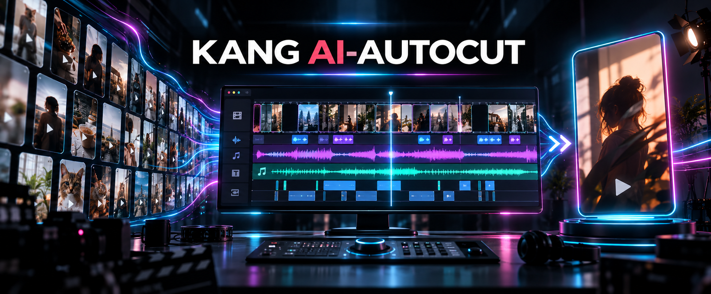
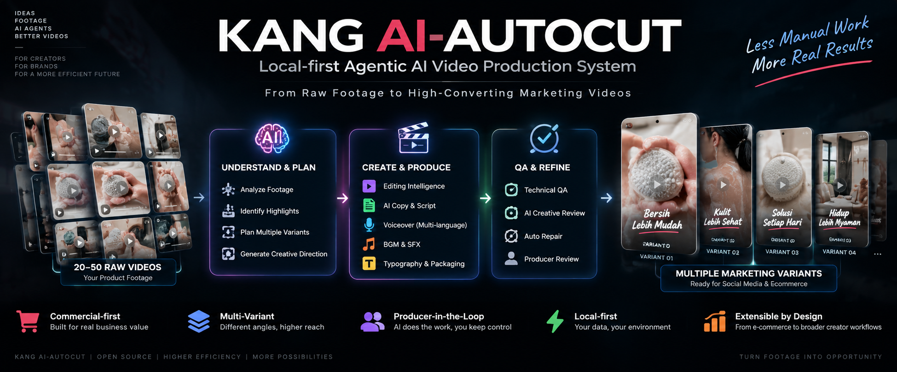

# Kang AI-AutoCut

**RAW FOOTAGE → TRACEABLE PRODUCTION → HUMAN-APPROVED VIDEO**

An agent-led, local-first system for commercial video production: product truth,
creative decisions, picture, voice, captions, technical checks, and human release
are connected through recorded job artifacts.

<table>
  <tr>
    <td width="72%" valign="top">
      <strong>REAL SKU PRODUCTION · HUMAN FINAL REVIEW: PASS</strong><br><br>
      <strong>Cushion Puff / Indonesia TikTok Commerce</strong><br>
      24-second vertical video · 1080 × 1920 · 30 fps · 12 edited segments<br><br>
      Seller-confirmed facts → approved commercial copy → fixed Creator Reference Voice and selected VO → picture edit → titles and spoken captions → final render.<br><br>
      <a href="docs/audit/cushion-puff-production-state.md">Read the production record and evidence boundaries</a>
    </td>
    <td align="center">
      
    </td>
  </tr>
</table>

*The banner is a concept visualization; the frame above comes from the approved video.*

**Source-footage context:** This video uses authorized repurposed clips of uneven quality, which limits the final picture and editing options; better-shot source footage would give future edits a stronger starting point.

[](docs/decisions/ADR-0007-local-first.md)
[](README.md#human-decisions-and-producer-gates)
[](README.md#installation)
[](README.md#installation)

*Badges are static. This repository runs no CI workflow, and the badge numbers are not
live status.*

**Languages:** English | [简体中文](README.zh-CN.md) | [日本語](README.ja.md) | [한국어](README.ko.md) | [Bahasa Indonesia](README.id.md) | [Deutsch](README.de.md) | [Español](README.es.md)

---

## What it is

**Give Kang AI-AutoCut a folder of raw product footage and a Producer Brief.**

The supervised, local-first workflow can understand the material, plan and build
an edit, coordinate job-authored commercial copy and external-provider audio,
render typography, review measured outputs, and move the job toward a video
that a person can approve. Multi-variant planning is one optional capability.

It is not a fully autonomous video factory. Two **principal human approval gates**
anchor the workflow:

- **Creative Copy Approval**
- **Producer Final Review**

These are not the only places a run can stop. The eight-stage Fast Path also opens
named `HUMAN`, `CODEX`, or `ADAPTER` Producer Gates when a required decision or
artifact is missing.

---

## Real SKU proof

**Cushion Puff / Indonesia TikTok Commerce (SKU #2): Human Final Review PASS.**
The 24-second vertical video completed Product Truth and Seller Confirmation,
visual-evidence and claim-boundary review, approved Commercial Copy, fixed Creator
Reference Voice and selected VO, picture planning and editing, titles and spoken
captions, final rendering, and **Human Final Review: PASS**. The approval names an
exact final artifact, not a general quality guarantee. See the
[production state and evidence boundaries](docs/audit/cushion-puff-production-state.md).

The master and source media remain in the production workspace outside Git; this
repository does not publish a video preview or master. This milestone demonstrates
a supervised real-SKU workflow, not an unattended run or a claim that every formal
eight-stage Fast Path gate passed.

The earlier **Faucet Filter (SKU #1)** has a reconciled Gold production result
documented in [Filter Gold v1](docs/gold/filter-gold-v1.md). Cushion Puff is the
newer Human-approved production result, not the first real SKU. The tag
`pre-third-sku-blind-v1` was frozen after those two SKU histories as a baseline
for a separate third-SKU exam; the tag name does not renumber either product.

---

## Real Production Workflow — Eight-Stage Fast Path

### What you do

1. **Add raw footage** — point the system at a directory of source video.
2. **State the goal** — product, platform, language, target duration, and what the
   video must and must not claim.
3. **Let the Agent run the pipeline** — it works through the stages and stops when
   it needs you.
4. **Answer the gates** — approve copy, supply a missing artifact, or make a
   creative call.
5. **Approve the final video** — a named human releases the master. That release is
   a separate decision from the review, and it names the exact master it approves.

### What the system does

The production control path executes **eight semantic stages**:

| # | Stage | What happens |
|---|---|---|
| 1 | **PREPARE** | Source inventory with immutable per-file digests |
| 2 | **UNDERSTAND SHOTS** | Media is analysed; measured timestamps map onto a CFR analysis grid to find real visual segments |
| 3 | **PLAN THE EDIT** | Timeline ranges are validated against observable action — a cut that misses the onset or the result is refused |
| 4 | **FINISH THE PICTURE** | Source ranges extracted through the timebase invariant, measured, and a KEEP / REVIEW / CORRECT decision made per shot |
| 5 | **PLAN THE WORDS** | Narration coverage is checked **before** any paid voice work; then screen copy is rendered |
| 6 | **BUILD THE AUDIO** | FIT / SYNC / RHYTHM judged separately; then the mix is built and **measured** |
| 7 | **ASSEMBLE & MASTER** | Delivery master produced, then verified against the file itself |
| 8 | **REVIEW & REPAIR** | All review dimensions judged; verdict derived; human release gate |

### How the two views map

```
USER VIEW                          SYSTEM VIEW (8 stages)
─────────────────────────────      ──────────────────────────────────────
1  add raw footage            →    PREPARE
2  state the goal             →    (job manifest + brief)
3  understand the material    →    UNDERSTAND SHOTS
4  build the editing strategy →    PLAN THE EDIT
5  construct the timeline     →    PLAN THE EDIT
6  finish the picture         →    FINISH THE PICTURE
7  titles / copy / typography →    PLAN THE WORDS
8  voice / music / audio      →    BUILD THE AUDIO
9  assemble and master        →    ASSEMBLE & MASTER
10 review and repair          →    REVIEW & REPAIR
11 human approval             →    REVIEW & REPAIR (human release gate)
12 final video                →    delivered master
```

### Stages stop on purpose

When a required input is missing, the run **stops and names who must act**:

```
   Stage ──▶ [ PRODUCER GATE ] ──▶ Stage
                 │
                 ├─ which artifact is missing
                 ├─ which producer is responsible (AUTO / CODEX / HUMAN / ADAPTER)
                 ├─ the input and output contract
                 ├─ the procedure to follow
                 ├─ the evidence required
                 └─ what must become true to resume
```

**A gate is not a failure.** It is the system declining to invent a creative
decision, or to claim work it did not do. Some stages are automated; others
legitimately need an Agent, a provider adapter, or a person. The language
"generate or prepare", "Agent supplies", and "job-authored when required" is used
deliberately throughout this README.

---

## Human decisions and Producer Gates

The workflow is designed around genuine human decisions, not around removing them.

```
Producer Brief → Eight-stage Fast Path → Named Producer Gates → Human release
```

Two **principal human approval gates** carry creative and release authority:

| Gate | What the Producer decides |
|---|---|
| **Creative Copy Approval** | the copy and the claims the video is allowed to make |
| **Producer Final Review** | whether the piece is released |

They are not the only stopping points. Between them, the Fast Path may open a
`HUMAN`, `CODEX`, or `ADAPTER` Producer Gate for any required decision or artifact.
Material understanding, edit planning, picture, typography, audio, mastering, QA
and repair are advanced under these explicit contracts. This is
**Producer-in-the-loop**, not unattended automation.

---

## Why it matters

The value is a reusable production record: an Agent can reason about creative
choices, local tools execute and measure media, and a person approves the claims
and the finished result. The project does not promise conversion or quality gains
from automation alone.

Kang AI-AutoCut treats video production as an **auditable engineering workflow**:

| Ordinary AI video output | Kang AI-AutoCut |
|---|---|
| One-off result, hard to repeat | A reusable workflow you run again |
| Decisions live in a chat log | Every decision is a recorded artifact |
| Failure means starting over | Jobs resume from the stage that stopped |
| "It looks done" is the only check | Output is measured: frames, black frames, freezes, loudness, true peak, master hash |
| A model can silently skip a step | A stage **cannot pass without naming the capability it ran** |
| Human judgement is invisible | Human input happens at named gates, and is logged |
| Media and provider inputs can be hard to trace | Processing is local-first; approved providers receive only the task's required inputs |

---

## What You Can Build

**Currently production-validated:**

- **Commercial advertising and e-commerce product video** — the first workflow
  taken end to end, including delivery-master verification.
- **Social-media short-form product content** — vertical, short-duration
  commercial edits, using the same eight stages.

**Direction the architecture is designed to extend into** — *not yet
production-validated*:

- creator and self-media video
- product demonstration and explainer content
- brand and campaign content
- other structured video-production workflows

The system is commercial-first today. Nothing here claims every video category is
already supported, and no content-mode framework exists yet.

---

## Current Capabilities & Wiring Status

### Available and verified today

| Capability | Notes |
|---|---|
| Source ingestion and immutable inventory | per-file SHA-256, re-verified before use |
| VFR-safe media understanding | measured timestamps mapped to a CFR analysis grid |
| Visual segmentation | runs on the grid the engine actually decodes |
| Timeline range validation | refuses cuts that miss observable action |
| Source-range extraction | every range resolved from a measured timestamp |
| Picture execution | produces a real video artifact, re-measured afterwards |
| Narration coverage | runs before any paid voice generation |
| Typography rendering | job-authored titles and opt-in, final-VO-aligned spoken captions; both used in the Cushion Puff result |
| Audio mixing and mastering | real mix, with measured loudness, true peak and clipping |
| Packaging and final master | `final/master.mp4` plus measured technical QA |
| Review contract and release verdict | every dimension judged once; verdict derived, not asserted |
| Targeted repair planning | scope-locked to the affected layer |
| Human release gate | a distinct decision naming the master it approves |
| Intervention ledger | written automatically whenever a gate halts a run |
| Resume and invalidation | resumes at the first incomplete stage; invalidating a stage re-opens everything downstream |
| Master integrity validation | digest recomputed; a deleted or altered master fails verification |

### Gated / job-authored

These run, but the artifact they consume is supplied per job — by an Agent, an
adapter, or a person:

| Capability | What is still supplied |
|---|---|
| Read-only picture measurement | no measurement tool ships in this repository |
| Product authenticity protection | same; its tolerance checks have not yet run on real data |
| KEEP / REVIEW / CORRECT decision | the decision runs; nothing here acts on a `CORRECT` |
| Audio program verification (FIT / SYNC / RHYTHM) | the voice placement it consumes |
| Voice / music generation | supplied by a provider adapter; **not built in** |

Commercial Strategy v1, Commercial Intelligence v1 and Commercial Copy v1 are
**`CONTRACT_ONLY / NOT_WIRED`**: their schemas, validators, examples and tests exist,
but no registered producer generates them in the production path. In the real
Cushion Puff production, an Agent authored the commercial strategy and localized
copy within the job, and a human approved the final copy and claim boundaries.
That job-level practice is production-validated; it does not make the formal v1
Commercial contracts wired generators.

### Planned / extensible

Not implemented, and not claimed: an automated commercial reviewer, generic
backend compilers, an artifact registry, a job queue, an unattended one-command
runner, and broader content-mode workflows.

---

## Multi-Variant Production

One source pool can produce **multiple commercially distinct variants**. Each
variant independently reconsiders the full pool rather than inheriting the
previous variant's timeline:

- it reconsiders **every** candidate, and does not mechanically inherit the
  previous variant's timeline
- it **may** reuse strong footage when that is commercially justified
- prior usage acts as a **soft diversity signal**, not a prohibition
- where candidate quality is comparable it prefers less-used footage
- it **never** sacrifices commercial quality merely to maximise de-duplication

> **Commercially meaningful variation outranks artificial maximum diversity.**

Variants may differ along the hook, the narrative angle, shot selection, shot
order, shot boundaries, pacing, voice-over, typography copy, BGM, SFX and
commercial emphasis. This is not one timeline rendered several ways.



*Earlier project concept illustration. It shows the intended workflow, not a production result or evidence that every pictured capability is wired.*

---

## Editing Intelligence

```
Candidate Window
    ↓  internal visual cut detection
Visual Segment
    ↓  semantic / action grouping
Timeline Shot
```

**Candidate Boundary ≠ Timeline Boundary**, and **no cut before comprehension**:
footage is understood before it is cut. The material decides how much narrative it
can support — a target duration does not force footage to fill a timeline.

> **Content-driven duration.** There is deliberately no universal fixed minimum
> shot duration.

Full contract: [`docs/policies/editing-intelligence.md`](docs/policies/editing-intelligence.md).

---

## Audio Intelligence

Each audio layer answers a different question:

| Layer | Role |
|---|---|
| Visual | Evidence |
| Title | Selling-point summary |
| VO | Marketing explanation + sales narrative |
| BGM | Emotion + rhythm |
| SFX / ambience | Realism + action emphasis |

Sound is designed as:

```
Visual Event  →  Sound Event  →  Timing  →  Mix
```

> **Sound must have visual or narrative justification.**

Water sound is not laid under a piece merely because the scene is a bathroom. Actual
running or rinsing water on screen may carry matching water sound; a restrained
scrub texture may accompany visible wet scrubbing; a hero product display with no
water source in frame should not attract obvious water sound.

Mix priority is **voice > evidence sound > music**.

Full policy: [`docs/policies/audio-intelligence.md`](docs/policies/audio-intelligence.md).

---

## Audio & AI Provider Architecture

This repository performs **local mixing and mastering** on audio assets the job
supplies. It ships **no provider client**: synthesis is not implemented here.

**Production audio is generated through an external provider.** The current
production audio provider is **Doubao / Seed Audio**, validated model
**`seed-audio-1.0`**, used for Indonesian voice-over, BGM and generated
SFX / ambience. The client lives outside this repository; the findings below shaped
the audio policy.

For Cushion Puff, the production workflow fixed a Creator Reference Voice,
generated multiple VO takes with the job's approved copy, and used **human
listening to select the final take**. That is production practice, not an
in-repository voice-generation or listening-selection client. The repository
consumes the selected job-local audio asset for mixing and mastering; see the
[voice profile](docs/providers/indonesia-beauty-creator-voice-v1.md).

```
External Audio Provider   (future Adapter layer — NOT built in)
        ↓
  generated VO / BGM / SFX assets
        ↓
  job-local audio assets
        ↓
  Audio Program  →  local Mix  →  local Master
                     (measured: loudness, true peak, clipping)
```

**What exists today:** the `BUILD THE AUDIO` stage consumes job-local audio
assets, mixes them with FFmpeg against the job's own targets, and measures the
result. It refuses a mix whose sample peak reaches full scale.

**What does not exist:** any built-in provider integration. There is no
one-click voice generation, and this repository contains no provider client.

**Historical context, labelled accurately.** Voice-over was produced through
**MiniMax `speech-2.8-hd`** during earlier validated production work. That is a
**past** evaluation, recorded in
[`docs/providers/audio-provider.md`](docs/providers/audio-provider.md); MiniMax is
**not** the current production provider. macOS `say` is likewise not a production
provider.

No key, token or credential value appears anywhere in this repository. Credentials
are referenced by environment variable name only.

---

## Architecture

| Document | Contents |
|---|---|
| [`docs/architecture/system-overview.md`](docs/architecture/system-overview.md) | interaction model, production control path, maturity |
| [`docs/architecture/supervisor-authority.md`](docs/architecture/supervisor-authority.md) | the Codex Supervisor boundary |
| [`docs/architecture/backend-neutral-timeline.md`](docs/architecture/backend-neutral-timeline.md) | one timeline, three backends |
| [`docs/architecture/operations.md`](docs/architecture/operations.md) | path roles, ASCII staging, verification rule |
| [`docs/contracts/`](docs/contracts/) | frozen contracts |
| [`docs/policies/`](docs/policies/) | editing, shot, typography, audio and review policy |
| [`docs/decisions/`](docs/decisions/) | architecture decision records |
| [`docs/audit/production-chain-manifest.md`](docs/audit/production-chain-manifest.md) | per-capability wiring and readiness |
| [`docs/audit/execution-runbook.md`](docs/audit/execution-runbook.md) | how to run every boundary |
| [`docs/audit/gate-g0-history.md`](docs/audit/gate-g0-history.md) | how the frozen baseline was reached |

### Repository layout

```
src/ai_autocut/          production code
  fast_path.py             the eight-stage control path
  producer_registry.py     every required artifact and its producer
  execution_contracts.py   the four execution boundaries
  execution_adapters.py    job-scoped picture / typography / audio / packaging
  timebase_adapter.py      the source-timestamp invariant
  media_probe.py           measured facts about a real media file
  ...                      contracts, policies, validators

tests/                   offline regression suite
schemas/                 frozen contracts and the Gold manifest
docs/                    architecture, contracts, policies, decisions, audits
scripts/                 the execution proof and the local-env wrapper
examples/                example job shape
config/examples/         configuration template
```

---

## Local-First Design

Local-first is a requirement, not a temporary state. The production control path
and all media processing run on the local machine, using Python, FFmpeg/FFprobe
and the local filesystem, with deterministic orchestration. Approved external AI
APIs may be used for selected intelligence or generation tasks; they are never the
control path. Cloud infrastructure — object storage, server platforms, distributed
workers, dashboards, user accounts — is deliberately absent. See
[ADR-0007](docs/decisions/ADR-0007-local-first.md).

No machine-bound absolute path appears in this repository. Every runtime location
is a logical role resolved from an environment variable; see
[`docs/architecture/operations.md`](docs/architecture/operations.md) and
[`config/examples/autocut.env.example`](config/examples/autocut.env.example).

---

## Use with an AI Agent

Kang AI-AutoCut is designed to be **operated with an Agent** — a model that can
act on your filesystem and shell, not a chat-only model.

It is **not tied to any single Agent product**. Compatibility is capability-based:

| The Agent needs to be able to… | Why |
|---|---|
| read repository files | follow `README.md`, `PROJECT_IDENTITY.md`, `AGENTS.md` |
| run shell commands | FFmpeg, FFprobe, Python, the test suite |
| read and write local files | job state, artifacts, media staging |
| execute Python and FFmpeg workflows | every stage is local and deterministic |
| understand structured JSON artifacts | jobs, reviews, evidence, manifests |
| **stop at a Producer Gate** | and ask you, rather than guessing |
| respect the repository's boundaries | media outside Git, no secrets, no machine-bound paths |

Examples of capable Agents include Codex, DeepSeek Harness, Claude Code, and other
coding or computer-use Agents. **These are examples, not requirements or endorsed
integrations.**

**A chat-only model cannot operate this system.** Without filesystem and shell
access it cannot run the pipeline; it can only discuss it.

### Internal governance vs public compatibility

These are different things and both are true:

- **Internally**, the validated production workflow uses **Codex as the
  top-level Supervisor.** Creative authority sits there, and the system is built
  so no deterministic component decides what a video should say.
- **Publicly**, the repository aims to stay **Agent-agnostic** wherever the
  architecture allows. Nothing in the control path is hard-locked to one vendor's
  Agent.

---

## Agent Quick Start

Give a capable coding Agent the repository URL and a prompt like this:

```text
Install Kang AI-AutoCut on this computer using the repository instructions.

Repository: https://github.com/KanG-ciyuan/Kang-AI-AutoCut

Before changing anything:
1. Read README.md, PROJECT_IDENTITY.md and AGENTS.md.
2. Check the environment: Python, FFmpeg/FFprobe, and the Python packages the
   code actually imports.
3. Report what is missing. Do not install anything I have not approved.

Then:
4. Configure the local workspace and media root using only logical roles and
   environment variables. Keep media outside Git.
5. Never write an API key, token or credential into any tracked file, log or
   commit.
6. Run the repository self-tests before creating my first video job.

When we start a job:
7. Run the production control path and stop at every Producer Gate.
8. Ask me when a gate needs a human decision or creative approval.
9. Do not invent copy, art direction or claims on my behalf.
```

**What the Agent still has to do by hand.** Installation is *not* fully
automated today: there is no installer, no packaging manifest, and no declared
dependency lockfile. The Agent must inspect the environment, install prerequisites
you approve, and configure local paths. The README below lists exactly what is
verified, and the repository contains no `pyproject.toml` or `requirements.txt` —
that is a known documentation gap, not a hidden step.

---

## Installation

### Verified prerequisites

| Requirement | Status |
|---|---|
| **Python 3** | verified on 3.11.15. The repository declares no minimum version — treat that as a gap. |
| **FFmpeg and FFprobe** | required, **4.4 or later** for the production path; the test suite additionally needs **5.1 or later**. Verified end-to-end on 5.1.2, 6.1.2 and 9.0.1. |
| **`numpy`** | required by the media-understanding module |
| **`Pillow`** | required by the typography execution adapter |
| **macOS** | verified on macOS arm64. Windows and Linux are **not** verified. |

#### FFmpeg versions: two floors, both measured

Two different boundaries were measured on real media rather than inferred from release
notes, and they are not the same boundary:

- **Production path: 4.4.2 and later.** FFmpeg 4.4.x answers `frame=pts_time` with an
  empty value for *every* frame while still exiting 0. The frame-timestamp reader now
  falls back to `best_effort_timestamp_time`, which was confirmed value-for-value
  identical to `pts_time` on 4.4.2, 5.0.1, 5.1.2, 6.1.2 and 9.0.1 for CFR and genuinely
  variable-frame-rate sources. Measured timestamps stay authoritative; only the field
  name changes, never the clock. A toolchain older than 4.4 is refused up front by name
  and version.
- **Test suite: 5.1.2 and later.** `-fps_mode`, which builds the variable-frame-rate
  fixture, is **absent from 4.4.2 and from 5.0.1** and present from 5.1.2. No single
  spelling spans that range, so the two VFR classes are reported as **skipped with the
  version reason** rather than failing inside a filtergraph with
  `Unrecognized option 'fps_mode'`. `tests/test_tool_version_gate.py` asserts both floors.

A toolchain can therefore run the product and still be unable to run one test fixture;
that case is reported as a skip, not as a failure.

No `pyproject.toml`, `setup.py`, or `requirements.txt` exists, so no Python version pins
are claimed here. Read the imports rather than trusting a lockfile that is not
there.

### Setup

```sh
git clone https://github.com/KanG-ciyuan/Kang-AI-AutoCut.git
cd AI-AutoCut

# Local configuration: resolves environment variables, never machine paths
cp config/examples/autocut.env.example .env.local
# edit .env.local: set AUTOCUT_MEDIA_ROOT and AUTOCUT_WORKSPACE
```

### Verify the installation

```sh
# Full offline regression — no network, no media required
PYTHONDONTWRITEBYTECODE=1 python3 -m unittest discover -s tests

# End-to-end execution proof — builds its own media, produces a real master
python3 scripts/run_pre_exam_proof.py --job-root /tmp/pre-exam-proof
```

The proof is deliberately two-phase: it stops at the human release gate, writes
the release naming the **verified** master, then resumes to completion. It fails
if the master is deleted or altered.

The commands below are supported repository entry points for job initialization
and the eight-stage control path. A separate one-launch orchestrator exists,
but it still pauses at Producer Gates and depends on job-authored inputs; see
the [execution runbook](docs/audit/execution-runbook.md).

### Your first job

```sh
# 1. Initialize a job (generic: any product, any source count)
python3 -m src.ai_autocut.job_foundation \
    --job-id my-first-job \
    --product-name 'My Product' \
    --source-root /path/to/footage \
    --workspace /path/to/job-workspace

# 2. Run the production control path
python3 -m src.ai_autocut.fast_path --job-root /path/to/job-workspace
```

It will stop at the first Producer Gate and tell you what is needed next.

Full instructions: [`docs/audit/execution-runbook.md`](docs/audit/execution-runbook.md).

---

## Agent & LLM Compatibility

Four different layers are easy to confuse. The system keeps them apart on purpose:

| Layer | What it is | In this project |
|---|---|---|
| **LLM** | a reasoning model | interchangeable, where a model is used at all |
| **Agent** | a model **plus tools** that can act on this repository | required to operate the system |
| **Provider** | an optional external service for generation or intelligence | pluggable; **not built in** |
| **Execution engine** | the deterministic local Python/FFmpeg pipeline | the only thing trusted to report that a step succeeded |

**No vendor lock-in by design.** The control path calls deterministic local
modules. Where a model or provider is involved, it is a producer that supplies an
artifact through a declared contract — so swapping the model or provider does not
change the pipeline.

**But compatibility is a capability question, not a brand question.** A model that
cannot read and write files, run shell commands, or respect a gate cannot operate
this system, however capable it is at reasoning.

---

## Current Status

| | |
|---|---|
| Frozen baseline | `pre-third-sku-blind-v1` → `b65a73b53040bd1ff5defe25e624a28f623b6847` |
| Freeze status | `CLOSED_AND_FROZEN` |
| Exam validity | `PASS_WITH_EXPLICIT_PRODUCER_GATES` |
| Production-validated scope | Commercial advertising / e-commerce video |
| Regression suite | 1,933 passing on 2026-09-28, offline, no network required |

A working **gated production control path** exists and has produced real,
independently verified delivery masters. It is still not an unattended one-click
editor, and it does not claim to be — Producer decisions remain part of the
workflow by design.

The earlier **Faucet Filter (SKU #1)** Gold and the Human-approved **Cushion Puff
(SKU #2)** result are distinct production histories. The tag above marks the
engineering baseline frozen before a third-SKU blind exam, not the first production
milestone. Cushion Puff validates its supervised result and does not make the
contract-only Commercial modules live generators.

---

## Known Limitations

- **Not an unattended editor.** A single launch now drives a job end to end, but
  Producer gates still stop the run by design.
- **No automated commercial reviewer.** The review contract records a judgement; it
  does not produce one.
- **Picture measurement and product protection are job-authored.** No measurement
  tool ships here, and the protection tolerance checks have not yet run on real
  data — the gate has been proven to refuse, not to evaluate. Occlusion evidence
  for typography placement is authored the same way.
- **The `CORRECT` picture branch has never fired** in a production run.
- **No audio provider client ships in this repository.** Production audio is
  generated through an external provider (see below); the pipeline here consumes
  job-local assets.
- **Typography art direction is locked to one baseline.** `Typography Art Direction
  A v1` defines the design language, a closed zone set and a reviewer; a job selects
  it rather than inventing a look. Placement evidence is job-authored — the system
  consumes occlusion evidence, it does not measure occlusion itself.
- **The execution proof uses generated local audio.** It proves the mixing and
  mastering path, not a real voice performance.
- **No artifact registry and no job queue.** Large staging data is cleaned up by
  hand.
- **No generic backend compilers.** `compile_for_backend` raises for every
  backend; execution happens through job-scoped adapters instead.
- **No declared dependency manifest.** No `pyproject.toml` or lockfile exists.
- **Verified on macOS only.** Windows and Linux are untested.
- **Tracked, unresolved:** run-aware visual segmentation (C-01) and automatic
  selected-range verification ("needs vision").
- **Editing Intelligence vNext companion contracts.** The `candidate_evidence.v1`
  and `candidate_evidence.v2` documents are produced in shadow, and
  `hook_decision.v1` is produced in shadow from them. `planning_evidence.v1` remains
  contract-only: validated and tested, with nothing writing or reading it. See
  [`docs/contracts/`](docs/contracts/).
- **Candidate extraction, analysis and hook decision run in shadow only.** A
  `VNEXT_SHADOW` stage can now build Candidates from measured material, validate their
  windows, and produce a validated `candidate_evidence.v1` through the authoring seam,
  and a third stage (`DECIDE THE HOOK`) turns that evidence, the Creative Brief and the
  permitted Product Facts into a validated `hook_decision.v1` — with no production
  wiring and no sequence planning. Structured analysis is provider-independent: it is
  validated offline against deterministic and recorded answers, and an opt-in harness
  (`scripts/phase25_live_validation.py`, never part of the test suite) can hand real
  sampled frames to a live multimodal analyzer with exact source-frame labels. A run
  during development reported a model reading those frames and producing valid
  evidence; **that run's artifacts are not preserved in this repository and have not
  been independently verified**, so treat the harness as a capability, not as proof
  of a result. `candidate_evidence.v2` carries structured visual observations —
  including `NO_ACTION` and `PROBLEM_STATE_VISIBLE` — so a later stage can plan from
  machine truth rather than prose; commercial claims remain bound to Product Facts,
  and contract validity is reported separately from the declared pixel checks, which
  measure one statistic each and never semantic or commercial truth.
- **The hook decision is one model call and a deterministic veto.** The model ranks
  between two and five genuinely different hypotheses and owns that ranking; the stage
  never re-ranks it, never scores it, and never invents a reason. Exactly one eligible
  hypothesis is selected; when several are eligible the decision is left **pending**
  (`selected_hook_id: null`, owner unassigned), because preferring one viable angle over
  another is the owner's call, not the gate's; when none is eligible the decision records
  insufficient evidence. A hypothesis is vetoed when it **declares** a Product Fact the
  Claim Envelope does not permit, when a declared Candidate is not an analysed Pool
  member, when a `DIRECT` claim is not recorded in the structured evidence, or when the
  evidence lacks what the Hook type requires. That last point is the honest limit: the
  gate validates declared fact references, and cannot prove a premise declared every fact
  it implicitly rests on. Nothing re-reads the video, no second model reviews or debates
  the answer, and no shot order, timeline, voice-over, subtitle or final call to action is
  produced. The model's own ordering is preserved in
  `planning/hook_planning_response.json`; the decision document is sorted by `hook_id` and
  is not a ranking.

---

## Roadmap

1. **Close the remaining job-authored evidence.** Typography placement evidence and
   picture occlusion evidence are authored per job; the contract can carry them, no
   producer measures them yet.
2. **Keep reducing human intervention** where the evidence supports it, without
   removing the Producer gates that carry real authority.
3. **Widen the validated scope** beyond commercial advertising once the commercial
   workflow is stable.

The frozen baseline remains frozen and is examined **as frozen**: it records the
exact system that was audited and accepted.

---

## Frozen Baseline

```
tag             pre-third-sku-blind-v1
target commit   b65a73b53040bd1ff5defe25e624a28f623b6847
```

**What "frozen" means here:** a reproducible pre-exam baseline exists. The tagged
commit is the exact system that was audited and accepted, so the next exam run can
be compared against a known state rather than a memory of one.

**What it does not mean:** that the product is finished, that every capability is
automated, or that the system is production-complete. Documentation commits may
land on `main` after the tag; the tag itself does not move.

---

## Licence

**Apache-2.0.** The full licence text is at [LICENSE](LICENSE). Rationale, the
no-`NOTICE` decision, and items still open for a later stage are recorded in
[LICENSE_DECISION_PENDING.md](LICENSE_DECISION_PENDING.md).

---

## Canonical Identity

- Project ID: `ai-autocut`
- Default branch: `main`
- Runtime data root: logical role `AUTOCUT_WORKSPACE`
- Media root: logical role `AUTOCUT_MEDIA_ROOT`

The machine-readable identity record is
[PROJECT_IDENTITY.md](PROJECT_IDENTITY.md). Agent entry rules are in
[AGENTS.md](AGENTS.md).
